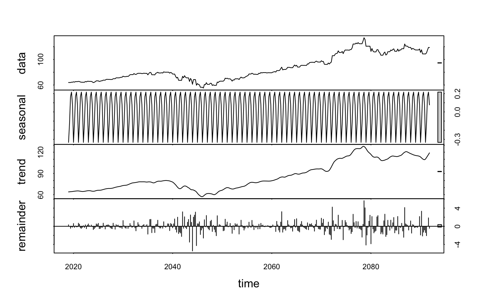
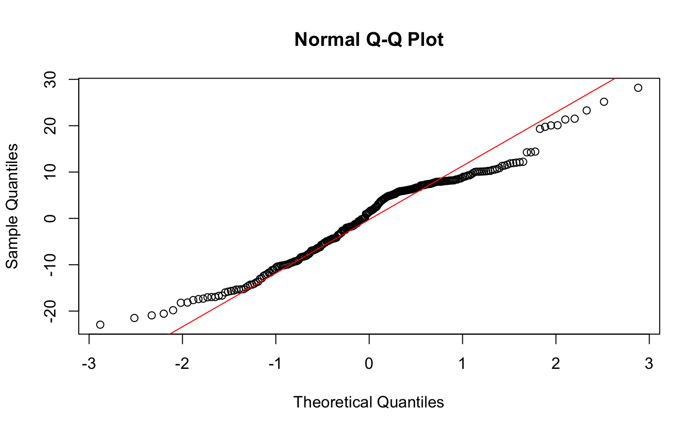

# 📈 Stock Price Forecasting and Investment Strategy Analysis

This project explores the use of statistical modeling to forecast stock prices and guide investment decisions. Using real-world financial data, the analysis compares multiple models to evaluate predictive accuracy and simulate portfolio performance.

---

## 🎯 Project Highlights

- **Techniques Used**:
  - Time series decomposition
  - Linear and exponential smoothing
  - ARIMA model forecasting
  - Simulated trading strategy comparison

- **Key Insights**:
  - ARIMA model offered more stable long-term predictions
  - Momentum-based strategy outperformed naive buy-and-hold under certain volatility conditions
  - Accurate forecasting can significantly reduce investment risk

---

## 🧰 Technologies Used

- **Language**: R (R Markdown)
- **Libraries**: `forecast`, `ggplot2`, `TTR`, `readxl`, `dplyr`
- **Visualization**: Time-series plots, residual analysis, strategy performance comparison

---

## 📁 Files

- `/code/` – Source `.Rmd` file with all analysis and modeling
- `/data/` – Raw Excel data file used for modeling
- `/assets/` – Visualizations from the analysis (`img1.png` to `img8.png`)
- `/report/` – [Final analysis report PDF](report/analysis.pdf)
- `README.md` – You are here

---

## 🧠 Sample Visuals

| Forecast Comparison | Strategy Returns |
|---------------------|------------------|
|  |  |

---

## 🙋‍♂️ About Me

I'm a graduate student in Analytics with a strong interest in time-series modeling, financial forecasting, and simulation-based evaluation of investment strategies.

---

## 📬 Contact

Feel free to connect via [LinkedIn](https://www.linkedin.com/in/allen-lei-zhao/) or email me at: `allen.lei.zhao@gmail.com`

